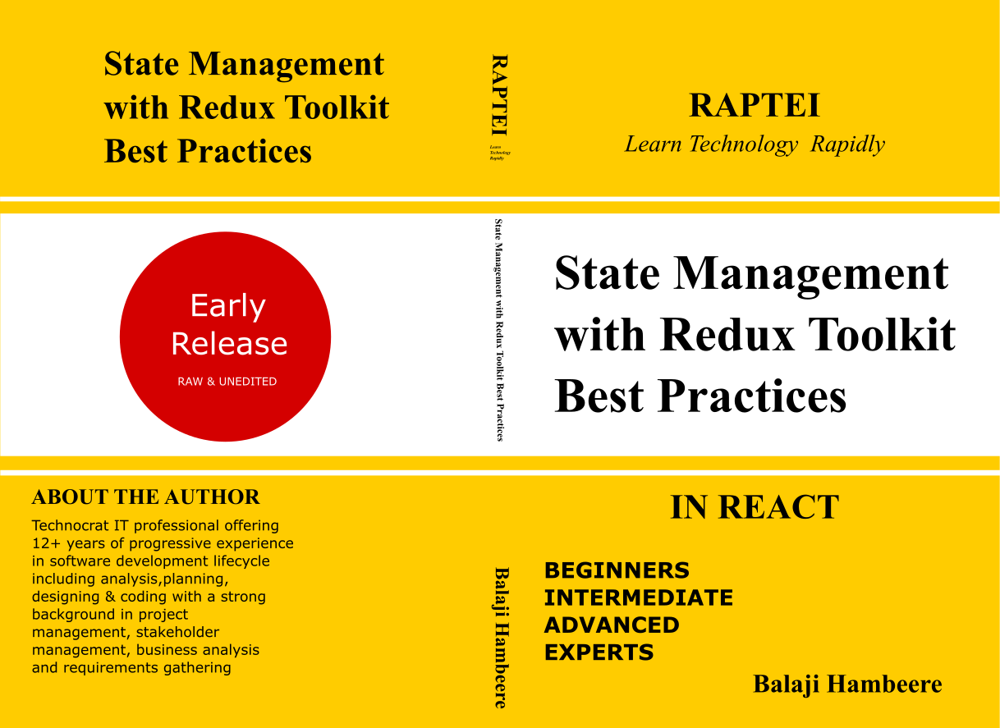

# State Management With Redux Toolkit Best Practices

### The code samples for State management with  Redux Toolkit Best Practices by Balaji Hambeere will soon publish on Amazon.

### If you want to learn how to build efficient & Complex React applications. This Book provides best practices and patterns for Managing the State in modern React Applications using Redux Toolkit.

#

State Management with Redux Toolkit Best Practices
by Balaji Hambeere
Released June 2022
Publisher(s): Amazon KDP
ISBN: --

